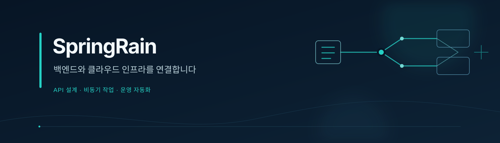

  

  <strong>안정적인 서비스와 효율적인 운영을 함께 만듭니다.</strong>

  
  
  
  
  
  

  <a href="https://chunwoolee.com/">개인 사이트</a> ·
  <a href="https://chunwoolee.com/projects/">프로젝트</a> ·
  <a href="https://chunwoolee.com/blog/">블로그</a>

## 소개

안녕하세요, **SpringRain**입니다. 백엔드 API 개발부터 클라우드 인프라 구축과 운영까지, 서비스가 안정적으로 동작하는 전체 흐름을 다룹니다.

Python과 TypeScript로 API를 설계하고, 비동기 작업과 리소스 수집 체계를 구성합니다. 반복되는 운영 업무를 자동화하고, 장애 원인을 추적하기 쉬운 시스템을 만드는 데 관심이 있습니다.

## 집중하는 영역

| 백엔드 개발 | 클라우드 인프라 | 운영 자동화 |
| :--- | :--- | :--- |
| REST API와 일관된 요청·응답 스키마 | 클라우드 및 가상화 플랫폼 연동 | 반복 업무를 줄이는 CLI와 스크립트 |
| 비동기 작업 처리와 상태 추적 | 컨테이너 기반 개발·운영 환경 | 리소스 수집과 실시간 모니터링 |
| 데이터 모델링과 쿼리 최적화 | 고가용성과 안정적인 배포 구조 | 문제를 재현하고 원인을 추적하는 도구 |

## 사용 기술

| 분야 | 기술 |
| :--- | :--- |
| 언어 | Python · TypeScript · JavaScript · Rust · Bash · SQL |
| 백엔드 | FastAPI · NestJS · Express · Pydantic |
| 데이터 | PostgreSQL · MySQL · MariaDB · SQLAlchemy Async · TypeORM |
| 비동기 처리 | Redis · RabbitMQ · Tokio · WebSocket |
| 인프라 | Linux · Docker · Docker Compose · Kubernetes |
| 클라우드·가상화 | AWS · Azure · Naver Cloud · Proxmox · XenServer · OpenStack |

## 개인 사이트

### [chunwoolee.com](https://chunwoolee.com/)

백엔드 개발과 클라우드 인프라 경험, 프로젝트, 기술 기록을 정리한 개인 포트폴리오 사이트입니다. 클라우드 관리 플랫폼, 서비스 API, 모니터링 에이전트와 운영 자동화 프로젝트를 소개합니다.

| 바로가기 | 내용 |
| :--- | :--- |
| [프로젝트](https://chunwoolee.com/projects/) | 프로젝트별 역할, 사용 기술, 구현 경험 |
| [블로그](https://chunwoolee.com/blog/) | 개발과 서버 운영에 관한 기술 기록 |
| [사이트 저장소](https://github.com/chunwoolee-dev/chunwoolee.com) | Hexo · NexT 기반 소스와 GitHub Actions 배포 구성 |

**사이트 구성:** Hexo · NexT · Node.js / **배포:** GitHub Pages · GitHub Actions

## 경험과 관심

- **클라우드 관리 플랫폼** — 가상 머신, 서버, 네트워크, 스토리지를 다루는 API와 백그라운드 작업을 개발합니다.
- **서비스 백엔드** — 인증, 데이터베이스, 실시간 통신을 연결하고 서비스에 맞는 서버 구조를 설계합니다.
- **운영 도구** — Rust 기반 모니터링 에이전트와 Bash·Python 스크립트로 리소스 상태를 수집하고 운영 흐름을 개선합니다.

---

명확한 API, 추적 가능한 작업, 자동화된 운영을 지향합니다.

